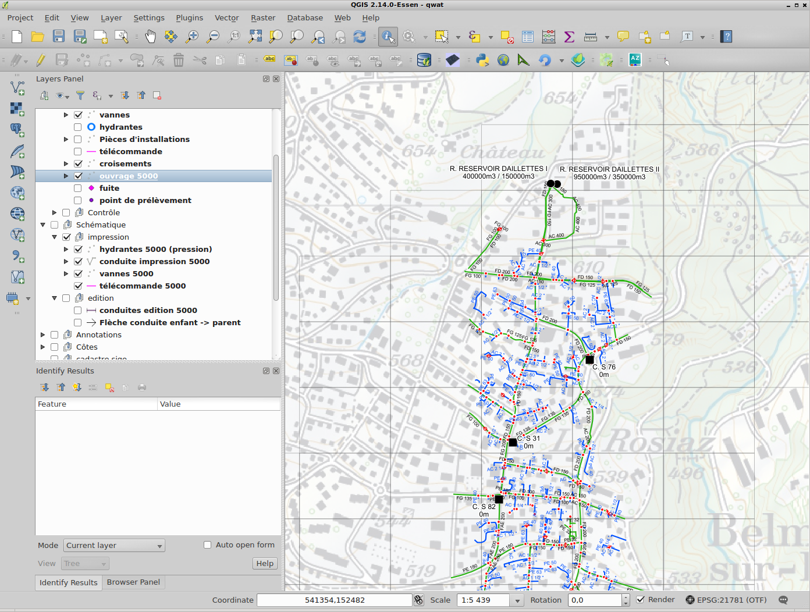

# qwat-data-sample

**DISCLAIMER: since 1.3.0 (2017-12-01)- data samples are found within each [data model release](https://github.com/qwat/qwat-data-model/releases).**

This repository holds now **OLD data** samples for the QWAT water distribution management project

 - qwat_vx.x.x_data_only_sample.backup : a data only backup, to be used after using init script
 - qwat_vx.x.x_data_and_structure_sample.backup : a full backup with data and structure.


However, instructions remain valid for restoring data or structure dumps :

Usage:

- create a new database named qwat, and initialise postgis and hstore extension
```
psql -U postgres -c 'create database qwat;'
psql -U postgres -d qwat -c 'create extension postgis;'
psql -U postgres -d qwat -c 'create extension hstore;'
```

CASE 1 - If you developp or customize the data model, you need to rebuild the DB from the sources:

  - first, initialize th DB structure using the procedure described here https://github.com/qwat/QWAT/blob/master/README.rst

  - Then restore the data only file qwat_v1.x.x_data_only_sample using pgadmin  (backup file only) or with command below (backup using `pg_restore`) or flat SQL file using psql:
  
    ```
    cd /location_to_dump_files
    # pg_restore using custom format dump
    pg_restore --dbname qwat --jobs=3 --data-only --disable-triggers  --no-owner --port 5432 qwat_v1.x.x_data_only_sample.backup
    
    # OR using SQL flat file
    psql -U postgres -f qwat_v1.x.x_data_only_sample.sql qwat   
    ```
   

CASE 2 - you can also restore a full standalone database

     ```
        pg_restore --dbname qwat --jobs=3 --disable-triggers  --no-owner --port 5432 qwat_v1.2.1_data_and_structure_sample.backup
        
        # OR using SQL flat file
        psql -U postgres -f qwat_v1.x.x_data_and_structure_sample.sql qwat
     
     ```


 - Now open the qgis project **qwat.qgs** from the main qwat repository (https://github.com/qwat/QWAT/tree/master/qgis-project)
and you should see this screen:




# For developpers

dump are generated with the following options: 

 ! make sure to change versions and connection informations before reusing it !


## dump data only - custom format (but postgres version dependant ) 
```
/usr/bin/pg_dump --host localhost --port 5432 --username "postgres" --no-password  --format custom --blobs --section data  --compress 5 --verbose --file "/home/regis/OSLANDIA/projets_locaux/QWAT/qwat-data-sample/qwat_v1.2.1_data_only_sample.backup" --schema "qwat_dr" --schema "qwat_od" "qwat"
```

## dump data only - plain text (better interoperability between postgreSQL versions)

```
/usr/bin/pg_dump --host localhost --port 5432 --username "postgres" --no-password  --format plain --blobs --section data   --verbose --file "/home/regis/OSLANDIA/projets_locaux/QWAT/qwat-data-sample/qwat_v1.2.1_data_only_sample.sql" --schema "qwat_od" --schema "qwat_dr" "qwat"
```


## Full dump - custom format (but postgres version dependant )

```
/usr/bin/pg_dump --host localhost --port 5432 --username "postgres" --no-password  --format custom --blobs --compress 5 --verbose --file "/home/regis/OSLANDIA/projets_locaux/QWAT/qwat-data-sample/qwat_v1.2.1_data_and_structure_sample.backup"  -N "public" "qwat" "qwat"
```


## Full dump - plain text (better interoperability between postgreSQL versions)

```
/usr/bin/pg_dump --host localhost --port 5432 --username "postgres" --no-password  --format plain --blobs --verbose --file "/home/regis/OSLANDIA/projets_locaux/QWAT/qwat-data-sample/qwat_v1.2.1_data_and_structure_sample.sql" -N "public" "qwat"
```


